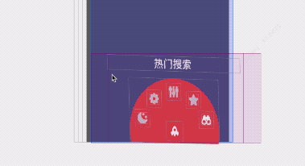

title: 复刻cosmos开源3D菜单YZ3DMenu
categories:
  - iOS
tags:
  - 开源
  - iOS
date: 2021-12-14 08:08:08

# 前言

本文具有强烈的个人感情色彩,如有观看不适,请尽快关闭. 本文仅作为个人学习记录使用,也欢迎在许可协议范围内转载或使用,请尊重版权并且保留原文链接,谢谢您的理解合作. 如果您觉得本站对您能有帮助,您可以使用RSS方式订阅本站,这样您将能在第一时间获取本站信息.

上图先看效果

 

这个菜单是个3D菜单,之前在一个叫cosmos的app中出现,之前一直想找个时间把这个功能搞出来开源.之后出现了一个类似微博的开源项目[Cosmos](https://github.com/zhnnnnn/ZHNCosmos) 这一阵子有时间 把这个组件重写一遍.

## 实现原理

* 通过tabbar的按钮触发(内部封装pan手势)时机,开始拖拽中、结束或取消...
* 添加新window 并在window上覆盖了 Blur模糊和容器,以及封装的仪表盘菜单视图
* 滑动过程中改动菜单视图(仪表盘菜单)的m34动画属性实现 倾斜滑动.

 

